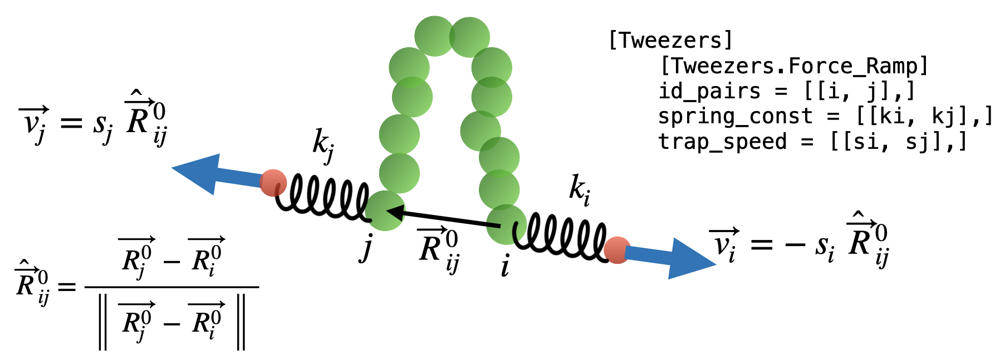

# Tweezers option

`[Tweezers]` option is to mimic the experiments using optical tweezers [(wikipedia)](https://en.wikipedia.org/wiki/Optical_tweezers), in which highly focused lasers are used to grasp and manipulate micron-scale beads typically attached to biomolecules of interest. See e.g. Bustamante et al (2021) *Nat. Rev. Methods Primers* [10.1038/s43586-021-00021-6](https://doi.org/10.1038/s43586-021-00021-6) for a comprehensive review.
  

There are two different modes of operation implemented as follows.

## Constant Force mode

In this mode, it is assumed that one or more pairs of coarse-grained particles ($i$ and $j$) are gripped with optical tweezers and a constant force $\vec{F}$ is applied to each pair in opposite directions.


### Input file

```
[Tweezers]
    [Tweezers.Dual_Constant_Force]
    id_pairs = [[1, 5],]
    forces_pN = [[5.0, 0.0, 0.0],]
```

* `id_pairs` specfies the particle pairs that are subject of constant force. In the example above, particles 1 and 5 will be the subject of external force.
* `forces_pN` specifies the force vector applied to each pair. In the above example, $F_i = (f_x, f_y, f_z) = (5.0, 0, 0)$ pN is applied to the first particle. The exact opposite force, $F_j = (-5.0, 0, 0)$ pN, is applied to the particle 5. 

## Force Ramp mode

In the `Force_Ramp` mode, a pair of particles $i$ and $j$ are each trapped by tweezers with harmonic potentials with the spring constants $k_i$ and $k_j$. The positions of the two traps are initially located at the same position as the particles $i$ and $j$ at time = 0 ($\vec{R_i^0}$ and $\vec{R_j^0}$). The trap positions move along the simulation with velocity $\vec{v_i}$ and $\vec{v_j}$, which are defined by the initial-position vector $\left(\vec{R_j^0} - \vec{R_i^0}\right)$ and given absolute speeds $s_i$ and $s_j$.



### Input file

```
[Files]
	[Files.Out]
	types = [...., "twz"]
	
[Tweezers]
    [Tweezers.Force_Ramp]
    id_pairs = [[1, 27]]
    spring_const = [[5.0, 5.0],]
    trap_speed = [[0.0, 1.0e-6]]
```


* `id_pairs` specfies the particle pairs ($i$ and $j$) being trapped. 
* `spring_const` specifies the spring constant $k$ of harmonic potential applied to each pair, in the unit of $\rm{kcal/mol/Å^2}$.
* `trap_speed` specifies the absolute speed of the trap movement. The unit is Å per simulation time step.

* In the above example, the pair of particles 1 and 27 are each trapped with spring constants $k_1 = k_{27} = 5$ $\rm{kcal/mol/Å^2}$. The positions of the two traps are initially located at the same position as the particles at time = $0$ ($\vec{R_{1}^0}$ and $\vec{R_{27}^0}$). The trap positions move along the simulation at the speed given by $s_i = 0$ and $s_j = 10^{-6}$ Å per simulation step. In practice, as in this example, the first trap is fixed in the space by specifying zero speed. 

**DO NOT FORGET to add `"twz"` in `[Files.Out]` `types` to get information of extension and forces.**
    
### Output files

